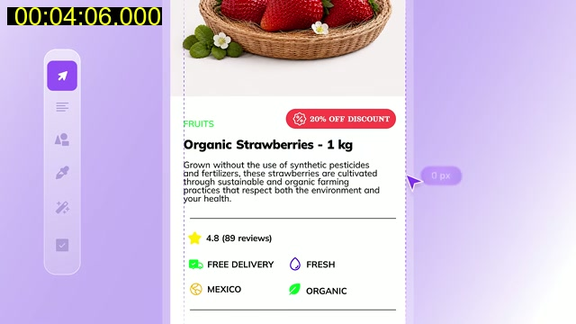
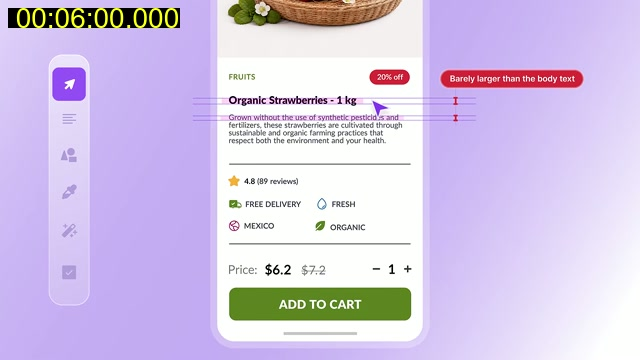
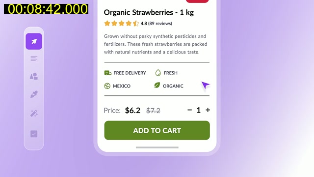
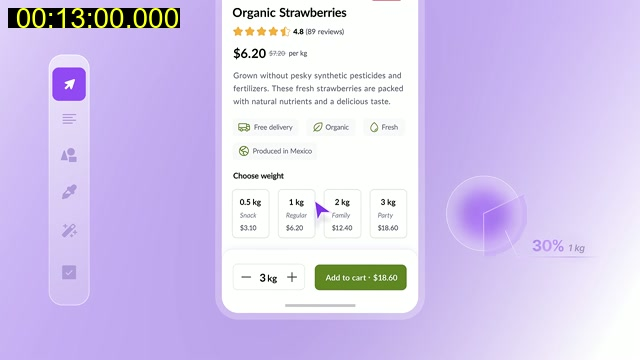

# uxpeak: "This UI/UX Redesign Will Teach You More Than 100 Tutorials Combined"

- Channel: uxpeak. URL: https://youtu.be/GGg61sdEjeI. Length: about 13.5 min.
- Method: video downloaded and viewed as contact sheets (a frame every 6 s, 135 frames) plus full-size pulls. **No transcript was obtained** (YouTube returned HTTP 429 for the subtitles on every retry). Everything below comes from what is on screen, including the presenter's on-screen caption bubbles. Tags below are therefore SHOWN, never "said". Frames saved are the 640 px sheet frames (the downloaded video was deleted from the shared scratch folder by another job before full-size pulls).
- Subject: one mobile product page (organic strawberries, add to cart) with 15 deliberate mistakes, fixed one by one. Mobile e-commerce, not a landing page, but most fixes are generic hierarchy rules.

## What is shown (timestamps are video time)

- 0:12-0:36: the "before" page with 15 numbered mistake markers. Before page: full-bleed photo, tiny body text, bright green button, red "20% OFF DISCOUNT" badge, cluttered attributes.
- 0:42-1:18: the back and menu icons sit on top of the photo and are hard to see. Fix: a calmer image, or a backdrop so controls stay readable (plain pineapple photo, then icons on white).
- 1:24: caption "Design for systems, not screens." Then inspiration research in a screen library.
- 2:00-3:30: the product image alone, six candidates A to F with a mood meter. A busy macro crop scores low, a dark hands-holding-fruit shot is "secondary", a clean cutout on neutral ground scores best. Final pick F: a strawberry basket on a clean light background. At 3:06 a product grid shows every item photographed the same way, so the set looks uniform.
- 3:42-4:06: a wireframe of the order of parts (category label, promo badge, title, description, social proof, attributes, price, CTA) with "Section Spacing" markers. Caption "It feels messy": sections nearly touch (a 0 px gap chip at 4:06). Zoom at 4:12 shows attributes and price crammed together.
- 4:18-4:30: colour. The bright green CTA with white text is measured at a contrast ratio of 1.80:1 and flagged. Reference apps shown (sg, Bolt).
- 4:36-4:54: palette swatches with three captions: "sets the mood", "supports product", "color guides attention". The CTA changes to a darker olive green with white text (large at 4:54).
- 5:00-5:12: type. Bolt example: one typeface family, three weights (Primary Bold, Secondary Medium, Tertiary Regular), caption "One typeface, different weights". Then a heading and subheading sample.
- 5:24-5:42: labels. The category label ("FRUITS") gets a small tracked-out treatment; the discount badge text is cut from "20% OFF DISCOUNT" to "20% off".
- 6:00-6:12: title was "barely larger than the body text"; it is enlarged. The CTA draws more attention. Before and after side by side at 6:12.
- 6:24-6:36: paragraph text flagged "hard to read" (small, low-contrast grey); the description is rewritten shorter and plainer (6:54) and set at a readable size.
- 6:48-7:12: rating stars with count moved from below the divider up to sit directly under the title. Captions "What is it?" (title) and "Can I trust it?" (rating) show the reading order. Price then sits under the rating.
- 7:30-7:42: before/after toggle with captions "It works" and "It builds trust".
- 7:48-8:12: sponsor segment (uxpeak course). Not design content.
- 8:24-8:42: the four attribute chips (free delivery, fresh, Mexico, organic) in a ragged two-by-two with inconsistent icon and text styles; red X marks captioned "Inconsistent styles".
- 8:48-9:12: fix: one row of four equal columns, icon above a short label, same icon weight and size; caption "Product benefits".
- 9:18-9:36: captions "Loose grouping" and weak proximity. Related items are pulled together, unrelated ones pushed apart. Grid lines snap the price block and button.
- 9:42-10:06: price and quantity grouped as one block; price shown with the old price struck through and a "per kg" unit.
- 10:18: the "1 kg" is removed from the title (it was a unit, not a name).
- 10:36-10:42: an information-flow list: image, category and discount, name, rating and reviews, price and quantity, description, features, CTA. Caption on price: it "determines price importance".
- 10:54-11:36: the price row gets a stepper; the CTA becomes a single bar "Add to cart · $6.20" with the quantity control beside it. Caption: "removes uncertainty".
- 11:48-12:30: bar kept in view; an "Often bought with" grid of related products added under the features.
- 12:42-13:06: "Improvement 3, predefined quantities": chips for 0.5 kg Snack, 1 kg Regular, 2 kg Family, 3 kg Party, each with its price. The CTA price updates when a chip is chosen. Caption "business impact".
- 13:18-13:24: final before and after side by side.

## Candidate rules for us

1. **Primary button text must reach at least 4.5:1 contrast on its fill (3:1 for large bold text).** Bright saturated greens fail with white text (1.80:1 shown). SHOWN 4:18-4:54. Testable: compute the ratio in the review script.
2. **Heading clearly larger than body; one typeface family with 3 weights for primary, secondary, tertiary text.** SHOWN 5:00-6:12. Testable: title size at least 1.4x body size; one font family on the page (plus the project's RTL swap).
3. **Order information by the visitor's questions: what is it, can I trust it, what does it cost, what do I do.** Name, then real proof, then price or packages, then the button. SHOWN 6:48-7:12, 10:36.
4. **Group related things tightly and separate unrelated things with clearly larger gaps.** Gap between groups at least 2x the gap inside a group. SHOWN 3:42-4:12, 9:18-9:36.
5. **Keep list items of the same kind identical**: same icon set, size, weight, alignment, one row or an even grid. SHOWN 8:24-9:12. Testable: all chips in a group share height and icon size.
6. **Put price and the action together**, and state the unit ("per kg", "per hour", "per session"). When the order has options, show the total on the button. SHOWN 10:24-11:36.
7. **Offer preset packages as chips with a plain name and the price** (half, regular, family, party; or 1, 5, 10 sessions). SHOWN 12:42-13:06. Fits bakeries, caterers, coaches, cleaners. Prices must be the real ones.
8. **Shorten labels and badges** ("20% off", not "20% OFF DISCOUNT"); keep descriptions short and plain, readable size and contrast. SHOWN 5:42, 6:24-6:54.
9. **Never place controls or text over a busy part of a photo without a calm backdrop**; choose photos where the subject is clear and the set looks consistent. SHOWN 0:42-1:18, 2:06-3:30. Testable with the project's overlay-alignment and readability scripts.
10. **Keep units out of names** ("Organic Strawberries"; the unit lives by the price). SHOWN 10:18. Minor.

### Rejected or restricted for honesty

- Rejected as a model: the "4.8 (89 reviews)" stars and count, unless they are the owner's real, checkable reviews. If none exist, omit the row. (SHOWN 6:48-7:12.)
- Rejected as a default: the red "20% off" badge with a struck-through old price. Use only when the owner really charged the old price and the discount is genuine and dated. (SHOWN throughout.)
- Rejected unless the owner confirms the offer exists: "Often bought with" cross-sell and any quantity discount such as "30% 1 kg". (SHOWN 12:00-13:06.)
- Fine as a principle: show the total price up front. Never hide fees to make the total look lower.

### Frames

-  4:06, spacing and zoom on crowded attribute and price rows.
-  6:00, title barely larger than body, CTA attention.
-  8:36, "inconsistent styles" marks on the chip grid.
-  13:00, weight chips with prices and the CTA total.
