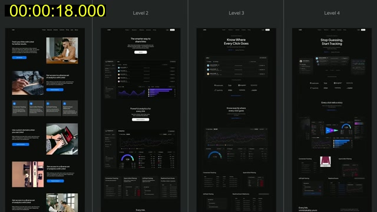
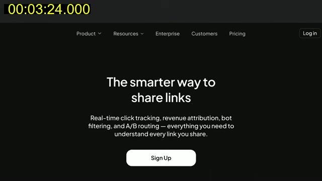
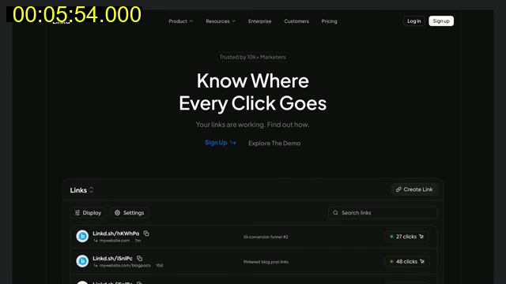
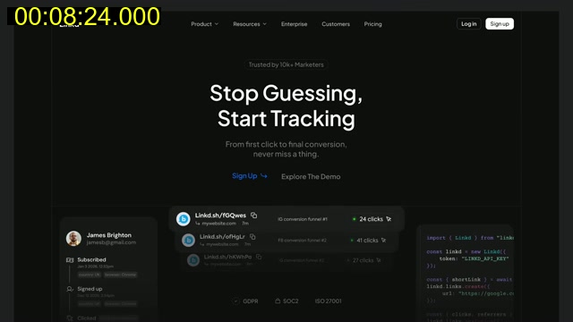

# Kole Jain: "The 4 Levels of Landing Page UI/UX Design"

- Channel: Kole Jain. URL: https://youtu.be/eMMiLeo_UGI. Length: about 10 min.
- Method: video downloaded and viewed as contact sheets (a frame every 6 s, 100 frames) with the English auto-captions read alongside. Saved frames are the 640 px sheet frames. Subject: the same fictional SaaS landing page ("Linkd", a link tracker, dark theme) redone at four quality levels. It is a software page, so only the structural lessons carry over to small local businesses.

## What is shown

- 0:00-0:20: the claim that okay pages do not convert; the four levels side by side in a strip at 0:18.
- Level 1, 0:22-2:14 (rated 2/10): left text, right stock photo, repeated all the way down (0:24-0:36, 0:48). Said: stock images unrelated to the product; sharp-cornered photos beside rounded buttons; same font throughout (good) but weak hierarchy; vague, long headline and body; the company name repeated in the headline when it is already in the logo (1:07-1:21); a flat nav where every item looks identical, weighted to the right (1:24-1:42); blue applied to anything that accepts it; no animation beyond a plain hover. Shown with red dashed overlays and a font label (1:00).
- Level 2, 2:16-4:14 (6/10): stacked, centred hero with the actual product dashboard under it instead of a stock photo (2:18, 3:06). Said: white buttons now, colour comes from the dashboard; shorter headline ("The smarter way to share links"); outlined Log in plus filled Sign up; other links centred; small hover drop-downs; the nav CTA and the hero CTA now carry the same label, implying the same destination (3:24); simple load animations; a clearer top-to-bottom flow.
- 4:16-4:46: sponsor read (Mobbin). Skip.
- Level 3, 4:48-7:20 (8/10): the dashboard is cropped to the meaningful part and framed (4:48-5:00); a "Trusted by" logo row and a small pill above the headline (5:06); the three-card row becomes a multi-select tab with a panel that switches (5:24-5:36); mega menu (6:36); large headline over a short grey subline (5:54-6:12); hover effects on the dashboard; sections shorter. Said: the headline is slightly overdone and dominates the subline; colour use fell because charts were cropped out.
- Level 4, 7:20-9:30 (10/10): visuals are crafted, not just cropped (7:30, 8:30); content moulded into a less rigid layout; looser spacing; copy moves from what it does to how it helps (7:54-8:14, "Every click tells a story" against "Know exactly where every click goes"); colour threaded through the page (8:30); blur transitions between sections (8:36); the mega menu stays open and its content shifts sideways instead of closing and opening (8:48-8:54); on the logo row a call-to-action link appears on hover instead of a permanent button (9:00-9:06). Said: no custom illustrations or 3D; attainable with attention to detail.
- 9:36: a before/after thumbnail promoting another video.

## Candidate rules for us

1. **Show the real thing, never an unrelated stock photo.** SHOWN 0:24-0:48, 2:18; SAID 0:44-0:49, 2:37-2:46. For us: the owner's own bread, kitchen, client work, truck, tour route.
2. **Centred, stacked hero (headline, one line, one button, then a large visual) beats a split hero repeated down the page**, and section layouts should vary. SHOWN 2:18, 3:06; SAID 0:35-0:44, 2:28-2:33.
3. **One short headline, one short subline;** do not repeat the business name next to the logo. SAID 1:07-1:21, 3:04-3:09. Testable: headline at most about 8 words in English, subline one or two lines.
4. **Corner style matches across images and buttons** (all rounded or all sharp). SHOWN 0:48-0:55, SAID 0:51-0:56. Testable: one radius token for cards, images, buttons.
5. **Nav hierarchy: the main action looks different from other links** (filled button, secondary action outlined), links balanced rather than all pushed right. SHOWN 1:24-1:42, 3:12-3:24; SAID 1:23-1:40, 3:11-3:19. One-pager version: logo, a few anchors, one filled call or WhatsApp button.
6. **Header button and hero button use the same label and go to the same place.** SHOWN 3:24-3:36; SAID 3:26-3:39.
7. **Headline dominates, but do not starve the subline;** hierarchy through size and colour. SAID 5:37-5:47; SHOWN 5:54-6:12.
8. **Write the outcome for the customer, not the feature.** SAID 7:54-8:14. For us: "Fresh challah for Shabbat, delivered Thursday" rather than "We bake bread". Outcomes must be true and checkable.
9. **Thread one accent colour through the page on purpose;** do not apply it to every element that can take it. SAID 1:46-1:52, 8:16-8:24; SHOWN 8:30.
10. **Shorter sections and a visible top-to-bottom flow** where each section leads into the next. SAID 3:49-3:56, 6:49-7:03.
11. **Smooth, restrained motion:** a soft blur or fade between sections, no abrupt swaps. SHOWN 8:36-8:48; SAID 8:26-8:44. Must respect reduced motion and keep content visible without JS (existing project rules).
12. **A hover-only call to action needs a visible equivalent on touch;** phones have no hover. SHOWN 9:00-9:06. Our adaptation: keep the link visible on mobile.
13. **A tab or segmented control to show several offers in one panel** instead of a row of identical cards (breakfast, lunch, events for a caterer). SHOWN 5:24-5:36; SAID 5:23-5:29.

### Rejected or restricted for honesty

- Rejected: the "Trusted by 10k+ Marketers" pill and the logo wall (SHOWN 5:06, 7:36). Only with real, verifiable clients or press and the owner's permission; otherwise omit.
- Rejected: invented dashboard numbers or counters used as decoration. Real figures or none.
- Rejected as a rule: the "worth $500 / $2,000 / $10,000" framing; it is the presenter's opinion, not evidence.
- Not applicable to a one-page local site: mega menus, product dashboards, SOC 2 or GDPR badges, developer code panels.

### Frames

-  0:18, level 1 to level 4 strip.
-  3:24, level 2: centred hero, outlined login, filled sign-up, matching CTA.
-  5:54, level 3 headline hierarchy and trust pill.
-  8:24, level 4 outcome-led headline and threaded colour.
